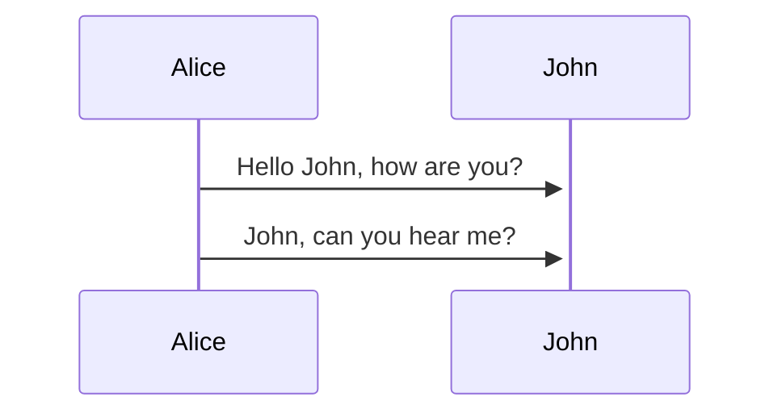
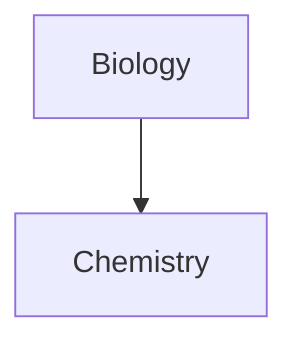

## Markdown

![[Pasted image 20240502085802.png]]


> [!info]
> Here's a callout block.
> It supports **Markdown**, [[Internal link|Wikilinks]], and [[Embed files|embeds]]!
> ![[Engelbart.jpg]]

> [!tip] Callouts can have custom titles
> Like this one

> [!faq]- Are callouts foldable?
> Yes! In a foldable callout, the contents are hidden when the callout is collapsed





| First name | Last name |
| ---------- | --------- |
| Max        | Planck    |
| Marie      | Curie     |

This is an %%inline%% comment.

===highlight===

> Human beings face ever more complex and urgent problems, and their effectiveness in dealing with these problems is a matter that is critical to the stability and continued progress of society. \- Doug Engelbart, 1961

- [x] This is a completed task.
- [ ] This is an incomplete task.

Text inside `backticks` on a line will be formatted like code.

```
cd ~/Desktop
```

```js
function fancyAlert(arg) {
  if (arg) {
    $.facebox({ div: '#foo' });
  }
}
```

### Links

[Obsidian Help](https://help.obsidian.md)
[Three laws of motion](Three%20laws%20of%20motion.md)


This is a simple footnote[^1].
You can also use inline footnotes. ^[This is an inline footnote.]

[^1]: This is the referenced text.

[^2]: Add 2 spaces at the start of each new line. This lets you write footnotes that span multiple lines.

[^note]: Named footnotes still appear as numbers, but can make it easier to identify and link references.

## Latex

$\frac{1}{2}$
$\sum_{1}^{3}$
$2^3$

$$
\begin{vmatrix}a & b
\\ c & d
\end{vmatrix}=ad-bc
$$

